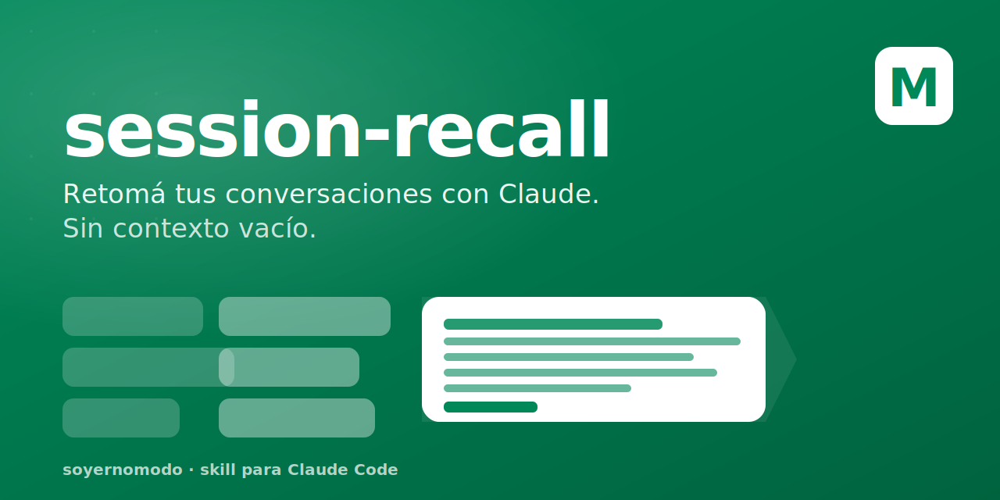

<p align="center">
  
</p>

<h1 align="center">session-recall</h1>

<p align="center">
  <em>Retomá tus conversaciones con Claude por tema o palabra, sin tener que volver a explicarle todo.</em>
</p>

<p align="center">
  <a href="https://github.com/SoyErnoModo/session-recall/actions/workflows/ci.yml"></a>
  
  
</p>

<p align="center">
  <a href="#instalación">Instalación</a> ·
  <a href="#cómo-se-usa">Cómo se usa</a> ·
  <a href="#qué-problema-resuelve">Problema</a> ·
  <a href="#cómo-funciona">Cómo funciona</a> ·
  <a href="#de-dónde-salió-la-idea">Inspiración</a>
</p>

---

## El problema que resuelve

Trabajás con Claude toda la mañana sobre un tema — un PR, una migración, un brief, una idea. Lo dejás abierto, cerrás la laptop, te vas a almorzar.

A la tarde volvés, abrís Claude para seguir, y arranca **en blanco**. Como si no se hubiera enterado de nada.

Tenés dos opciones malas:

1. **Re-explicarle todo** desde cero — perdés 10 minutos cada vez que cambiás de contexto.
2. **Buscar a mano** la conversación vieja — ¿pero cuál era? ¿la del lunes? ¿la del jueves?

`session-recall` te da una tercera opción:

> _Escribís una palabra del tema, y te devuelve **sólo la parte relevante** de cada conversación pasada — las decisiones que tomaste, los archivos que tocaste, lo que quedó pendiente — para que retomes donde lo dejaste._

---

## Qué hace, en una línea

Mirás todas tus conversaciones viejas con Claude desde una palabra clave, y te devuelve un resumen comprimido que podés pegar en una conversación nueva para seguir trabajando.

---

## Cómo se usa

Dentro de Claude Code (la terminal donde charlás con Claude), escribís:

```
/recall comercios
```

Y te devuelve algo así:

```
session-recall · `comercios`
3 sesiones encontradas — ordenadas por relevancia y recencia

TL;DR
1. Plan ToFu Comercios — 2026-05-15 · 42 menciones · rama feat/comercios-mvp
2. Mapa de comercios + API — 2026-05-12 · 30 menciones
3. Comercios database v0.1 — 2026-05-08 · 18 menciones

1. Plan ToFu Comercios
   Decisiones:
   - Cross-link al agent-plan.html
   - Fase 4 GEO apunta a sección 12 del agent-plan

   Archivos tocados:
   - plan.html
   - agent-plan.html

   Quedó pendiente:
   - Validar copy de fase 3 con marketing
```

Y si querés **retomar exactamente** la conversación de hace dos semanas:

```bash
claude --resume 3ff81d34-ac87-469e-ab1f-1e6ca58540bc
```

Listo. Claude vuelve con todo el contexto cargado, como si nunca hubieras cerrado.

---

## Lo que ves cuando lo corrés

Por cada conversación que matchea con tu palabra, el resumen incluye:

| Sección | Qué te dice |
|---------|-------------|
| **TL;DR** | Las conversaciones que mencionan el tema, ordenadas por importancia |
| **Lo que se decidió** | Las decisiones técnicas y de producto que tomaste en esa conversación |
| **Archivos tocados** | Qué partes del código modificaste |
| **Quedó pendiente** | Los TODOs, los "falta hacer X", los "queda revisar Y" |
| **Errores que aparecieron** | Si algo falló en esa conversación, queda anotado |
| **Última cosa que se dijo** | El contexto justo de cierre para que retomes |

Todo lo de relleno — los _"Let me check this"_, los outputs de comandos, los duplicados — se descarta. Sólo te queda **lo que tomaste como decisión** o **lo que dejaste a medio hacer**.

---

## Instalación

Necesitás:
- **Claude Code** instalado ([guía oficial](https://docs.anthropic.com/en/docs/claude-code))
- **Python 3** (viene con macOS)

### Opción A · una línea

```bash
curl -fsSL https://raw.githubusercontent.com/SoyErnoModo/session-recall/main/install.sh | bash
```

### Opción B · manual

```bash
git clone https://github.com/SoyErnoModo/session-recall.git
cd session-recall
./install.sh
```

El instalador copia:
- El **skill** a `~/.claude/skills/session-recall/` (para que el `/recall` ande).
- El **agente** a `~/.claude/agents/session-recall.md` (para análisis profundo cuando hay muchas sesiones).

Eso es todo. Abrís Claude Code y ya podés escribir `/recall <lo-que-sea>`.

---

## Cómo funciona (sin entrar al código)

Claude Code guarda **un archivo por cada conversación** que tenés en tu máquina, en `~/.claude/projects/`. Ahí está todo lo que se dijo, todos los archivos que se tocaron, todos los comandos que se corrieron.

`session-recall` hace tres cosas con esos archivos:

1. **Busca** los que mencionan tu palabra clave.
2. **Limpia** el ruido — el system info, los duplicados, los outputs largos, los pedidos automáticos del sistema. Se queda con lo que dijiste vos y con lo que Claude decidió hacer.
3. **Rankea** las conversaciones — las más recientes y con más menciones del tema arriba.

El resultado es un **resumen denso** de tu propia historia con Claude, hecho de pedazos verificables que podés retomar.

No usa cloud. No mira archivos fuera de Claude Code. No manda datos a ningún lado. Es un script local que lee tus propios transcripts.

---

## De dónde salió la idea

Hay un patrón que [Andrej Karpathy](https://karpathy.ai/) describe como el **LLM Wiki Pattern**: tu sistema operativo personal con la IA es, esencialmente, **un cuaderno bien indexado**. Lo que importa no es la conversación de hoy — es que mañana puedas encontrarla.

También hay un patrón más viejo, el **Zettelkasten** de [Niklas Luhmann](https://en.wikipedia.org/wiki/Zettelkasten) — un sociólogo alemán que escribió 70 libros sacando notas atómicas de un fichero. Una sola idea por ficha, todo enlazado por hilos.

`session-recall` aplica las dos ideas a tus conversaciones con Claude:

- Cada conversación es una ficha.
- La palabra clave es el hilo que las une.
- El resumen comprimido es la **vista** que te devuelve sólo lo que es load-bearing — lo que sostiene tu próximo paso.

La conversación termina cuando cerrás el chat. **El conocimiento queda.**

---

## Casos típicos de uso

> _"¿Qué decidimos hacer con la migración a Next 16?"_
> `/recall Next 16` → te trae las 3 conversaciones donde lo discutiste, con las decisiones técnicas, los archivos del migration plan, y los pendientes.

> _"Quiero seguir con el feature de comercios pero no recuerdo dónde lo dejé."_
> `/recall comercios` → primera línea del output: `claude --resume <id>`. Pegás eso, y volvés exactamente al estado.

> _"Hace un mes le expliqué a Claude las convenciones de PRs del equipo. ¿Las tiene anotadas o tengo que repetirlo?"_
> `/recall convenciones PR --since=60` → si están en algún transcript, te las devuelve.

> _"Le tengo que pasar a un colega el contexto del proyecto X."_
> `/recall <nombre del proyecto>` con el **agente** activado → te arma un brief en prosa que podés mandar por Slack.

---

## Privacidad

Todo corre **localmente en tu Mac**. El script lee `~/.claude/projects/` (donde Claude Code ya guarda tus conversaciones) y devuelve un resumen.

- No sube nada a un servidor.
- No depende de un API externo.
- Si borrás Claude Code, las conversaciones ya no existen — y el script no tiene a qué mirar.

---

## Roadmap (lo que vendría después)

- Búsqueda semántica además de keyword (`falla de pago` ≈ `error de cobro` ≈ `transaction declined`).
- Export a Obsidian / Notion para guardar el resumen como nota.
- Integración con Slack para "compartí este recall con tu equipo".
- Hooks para auto-distillar aprendizajes al cerrar una sesión.

---

## Créditos

- Inspirado en el **LLM Wiki Pattern** de [Andrej Karpathy](https://karpathy.ai/) y el **Zettelkasten** de Niklas Luhmann.
- Construido para [Claude Code](https://docs.anthropic.com/en/docs/claude-code) de Anthropic.
- Branding y voz de [Erno × MODO](https://soyernomodo.github.io/erno-modo/).

Autor: **Hernán De Souza** — Sr AI Engineer @ MODO. Si lo mejorás, abrime un PR.

---

## Licencia

[MIT](LICENSE). Hacé lo que quieras con esto — copiá, modificá, distribuilo. Sólo no me eches la culpa si rompés algo.
